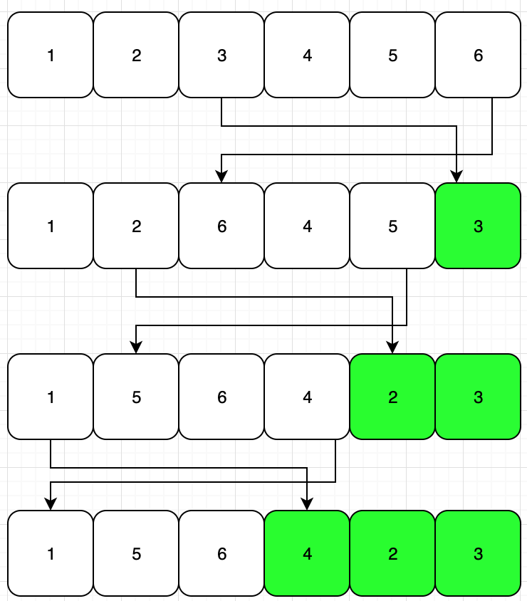
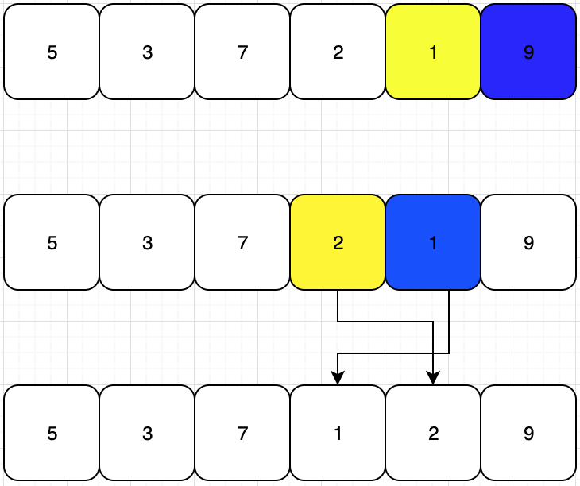
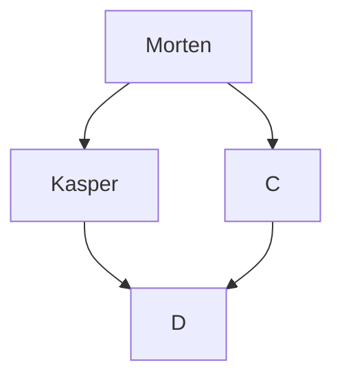

### Demo
**P5 DEMO HER**
[LINK TEXT](content/posts/p5js-demoRUN/index.html "LINK TITLE")

### Shuffling 
På billedet til under ses vores blandings algoritme. Vi starter ud med et array i sorteret rækkefølge. Herefter finder vi et tilfældig ramme i array’et. Dette bytter vi så rundt med det sidste spot i arrayet. Herfefter mærkere vi den sidste værdi i array’et som et blandet spot, og sætter derfor enden til en mindre. Det vil altså sige, at den i næste runde, betragter den andensidste værdi i array’et som den sidste.

### Sorting
Vi bruger i programmet “bubble sort” algoritmen. Vi kan se på diagrammet under at vi først kigger på de 2 sidste spots i arrayet, hvorefter den tjekker om det gule sport er størrer end det blå spot. Hvis dette er tilfældet, byttes disse om. Men da det ikke er tilfældet her, ser vi i stedet på de næste 2 spots i array’et. Dette bliver gentaget gennem hele algoritmen. Når algoritmen har kørt helt til bund, starter den forfra. Her kan den dog ignorer det første spot i arrayet, da denne værdi gerne skulle være den mindste overhovedet. Dette gentages indtil at algoritmen løber tør for spots, som resultat af mange omgange.





